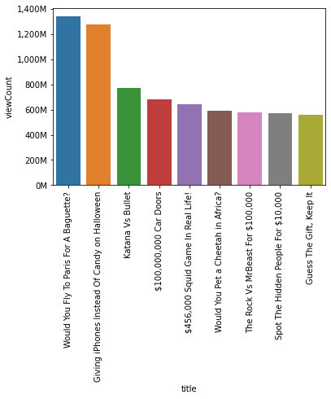
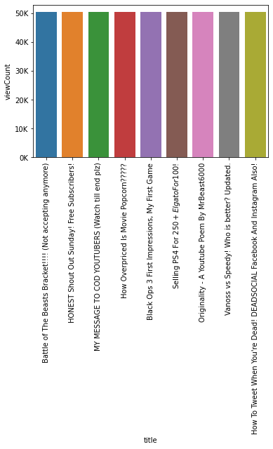
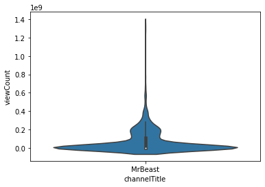
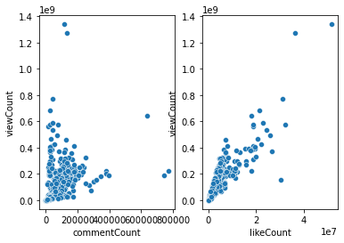
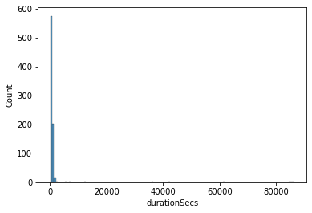
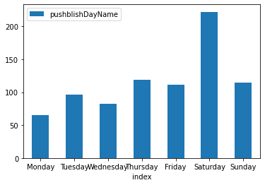

# MrBeast YouTube Channel Data Analysis

## Overview

This project analyzes data from MrBeast’s YouTube channel using the YouTube API. The analysis covers several aspects, including video performance, view distribution, engagement metrics, video duration, and video title trends. Additionally, the project includes an analysis of the upload schedule to visualize how frequently videos are posted on different days of the week.

## Objectives

### Best Performing Videos
- Identify the videos with the highest performance metrics, such as views, likes, and comments.

### Worst Performing Videos
- Analyze the videos with the lowest performance metrics to identify potential areas for improvement.

### View Distribution per Video
- Examine how views are distributed across different videos to understand viewership patterns.

### Views vs. Likes and Comments
- Compare views with likes and comments to assess engagement and interaction levels.

### Video Duration
- Analyze the duration of videos and its correlation with performance metrics.

### Wordcloud for Video Titles
- Generate a word cloud visualization to highlight common themes and keywords in video titles.

### Upload Schedule
- Analyze and visualize the frequency of video uploads on different days of the week.

## Data Sources

- **YouTube Data API**: Used to retrieve data on video metrics, including views, likes, comments, duration, and upload dates.

## Analysis

### Best Performing Videos
- **Output**: Bar chart displaying videos with the highest number of views.
  

    
  

### Worst Performing Videos
- **Output**: Bar chart displaying videos with the lowest number of views.
  

    
  

### View Distribution per Video
- **Output**: Distribution chart showing views per video.
  

    
  

### Views vs. Likes and Comments
- **Output**: Scatter plots and correlation analysis comparing views with likes and comments.
  

    
  

### Video Duration
- **Output**: Analysis of video duration and its correlation with performance metrics.
  

    
  

### Wordcloud for Video Titles
- **Output**: Word cloud visualization representing common keywords and themes in video titles.
  

    
  

### Upload Schedule
- **Output**: Graph showing the number of videos uploaded on each day of the week.
  

    
  

## Getting Started

1. **Setup**: Ensure you have access to the YouTube Data API and necessary libraries (e.g., `google-api-python-client`, `pandas`, `matplotlib`, `wordcloud`).
2. **Data Acquisition**: Collect data from MrBeast’s YouTube channel using the YouTube Data API.
3. **Analysis**: Follow the objectives outlined to perform the analysis and generate insights.
